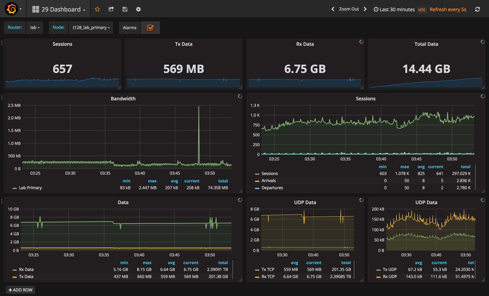

## 128T Grafana Datasource

This plugin provides support for the 128T product as a metric datasource. The 128T application exports a variety of analytical metrics which are accessed, by this plugin, via it's HTTP interface. In addition to analytics, this plugin also queries the alarm interface on the 128T product and displays them in Grafana as annotations.

